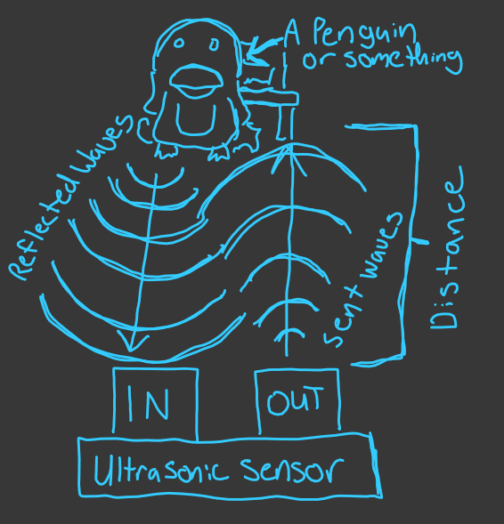
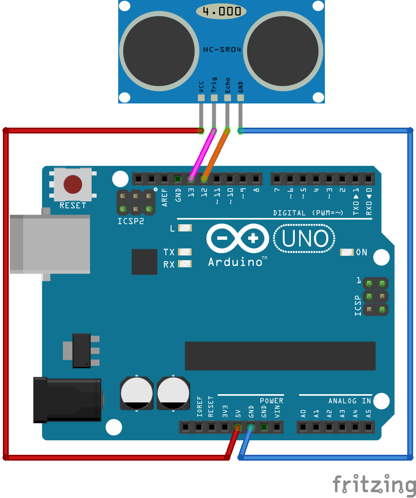

<steelsky>
{
  "title":"HC-SR04 Ultrasonic Distance Sensor With Arduino",
  "description":"How ultrasonic distance works",
  "tags":"#arduino #electronics #sensor",
  "type":"post",
  "date":"2021-03-01"
}
</steelsky>
# HC-SR04 Ultrasonic Distance Sensor With Arduino


## Required Components:

- Arduino Uno or comparable board
- HC-SR04 or comparable component
- 4 F/M jumper cables

## Disclaimer

I'm not an Electronic Engineer. I don't really know what I'm doing and I might be outright wrong about everything you are about to read.

## What exactly is an echo?

The basic idea here is just understanding the concept of an "echo". Yes, the same kind of echo you loved making in canyons or empty gyms as a kid. When you cause an echo, what you're experiencing is the sound traveling to some distant wall and then coming back to you. 

This is something that actually happens all the time, everywhere you go. Unless you are either in a very, very open space, a room with **perfect** sound treatment, or you happen to be in vacuum, the sounds you make are echoing. 

The reason you don't normally perceive the echo is that its happening so fast that its essentially indistinguishable from the original sound. Depending on the hardness of the surfaces around you, the echo might also be so quiet you just can't hear it. 

### A Side Note About Echo and "Reverb" (For Audio Nerds):

If you are a musician or familiar with audio concepts you might know these "mini echos" as something called "reverb". Even if you're not an audio nerd you might recognize "reverb" as the effect you get when talking in an unfurnished house or apartment. 

Essentially the difference between echo and "reverb" is just how long it takes for the sound to come back. If we perceive the sound as coming back to our ears very quickly and *before the original sound is complete* that is  "reverb" and if there is a distinct gap period between the original sound and the reflection coming back to our ear, that is what we call echo. 

## What Is Ultrasound

Most people have only heard the term "ultrasound" in terms of looking at an unborn child. While that technology uses a very similar concept to what we're talking about here, in this context "ultrasound" is just referring to any frequency that is above the limit of what humans can usually hear. 

So, since most humans can hear tones between 20 and 20,000 hertz, we call anything > 20k hz ultrasound. Not that its necessary to know for this application, but anything below 20 hz is known as "infrasound". Just to complete the picture, tones between 20 hz and 20k hz are commonly referred to simply as "sound".

## How Does An Ultrasonic Distance Sensor Work?

Ok, now that you (probably) scrolled right down to this section (at least skim the other parts), we can get started with the good stuff. 

An ultrasonic distance sensor works by sending a ultrasonic pulse and measuring the time it takes for that pulse to reflect and return to it's sensor. 

In more simple terms we are creating a pulse and measuing how long it takes for the echo to come back. The echo we are waiting for is just like the ones you hear in a canyon except for two things: 

* It is happening super fast (we're talking microseconds)

* It is ultrasound (Actually, I think most echos you make technically contain ultrasound)



*Note that this image is not to scale (Unless you know of some very small penguins or very large sensors). Also note that this is a terribly inaccurate depiction of how sound waves reflect.* 

Setting my copyright free drawing aside, here is what we need to do:

* Send a pulse
* Wait/listen for the pulse to come back
* Measure the amount of time the pulse took
* Do some math to convert the time measurement into distance

## Wait, There Is Math?

No, not really. If you don't want to understand this part you really don't have to. You can just plug in the constants, consider them to be magic beyond your understanding and move on with your life. However, you are going to miss out on a lot of boring numbers. 

If you don't want to understand the math and physics of how this works just skip to the part about setting up the board.

## Establishing A Constant For The Speed Of Sound ([Gotta' Go Fast](https://www.youtube.com/watch?v=Z9G1Mf6TZRs))

This first thing we need to understand is the speed of sound. This value is **NOT** a constant, but we are going to pretend that it is just to keep things simple. 

In "dry" air at about 20 degrees Celsius, sound will travel at \~343m/s. Since we're working on microsecond scales for time and centimeter scales for distance (get outta' here imperial measurements) we can also think of that as being **~0.0343cm/μs** (centimeters per microsecond).

`C = Speed Of Sound`
or
`C = 0.0343`

Another way to think about this would be to say that sound takes **~29.154** microseconds to travel 1cm. 

## Establishing Our Variables

The variables we are dealing with are:

* Δt (time delay)
* D (distance)

**Time delay** is the amount of time it takes between sending the signal and reviving the reflection of the signal. This value will be measured in microseconds (μs). 

**Distance** is the distance from the sensor that the detected object is. This value will be calculated as centimeters. 

## The Equation

```
Δt = Time Delay (μs)
C = Speed of Sound [0.0343cm/μs]
D = Distance (cm)
```

The cleanest way to represent the our calculation in my opinion is this:

`D = (Δt/2)C`

However, we could also do:

`D = (Δt/2)/29.154`

Or if you don't care much about accuracy and just want to use integers:

`D = Δt/29/2`


## Setting up the board

Ok, so now that we have the cool parts out of the way, let's actually setup to board. 

Connections:
* Vcc <- 5 V
* Trig <- pin 13 (digital pin)
* Echo -> pin 12 (digital pin)
* GND -> GND



Note: The direction of the arrows above indicates the signal flow but has no bearing on how you actually connect the pins.  

## The Code

Before we get started with the code, if you are new to programming on Arduino, take a few moments to look over the docs for the functions from the standard library that will be used in this example:

[Long](https://www.arduino.cc/reference/en/language/variables/data-types/long/)

[Unsigned Int](https://www.arduino.cc/reference/en/language/variables/data-types/unsignedint/)

[Pin Mode](https://www.arduino.cc/reference/en/language/functions/digital-io/pinmode/)

[Serial](https://www.arduino.cc/reference/en/language/functions/communication/serial/)

[Digital Write](https://www.arduino.cc/reference/en/language/functions/digital-io/digitalwrite/)

[Delay Microseconds](https://www.arduino.cc/reference/en/language/functions/time/delaymicroseconds/)

[Delay](https://www.arduino.cc/reference/en/language/functions/time/delay/)

[Pulse In](https://www.arduino.cc/reference/en/language/functions/advanced-io/pulsein/)

First we need to setup our constant unsigned integer variables to store the pin numbers we are using. Since we put the `Trig` input on pin 13 and the `Echo` output on pin 12 we will set up we will say:

```cpp
// Setup the pins
const unsigned int TRIG_PIN=13;
const unsigned int ECHO_PIN=12;
```

Then we need to declare out setup function that will initialize the board.

First we will use `pinMode()` to setup the `TRIG_PIN` as output and the `ECHO_PIN` as input. 

Then we turn on serial data writing so we can monitor the device on our development system.

Finally we will send a `LOW` value to the `TRIG_PIN` for 2 microseconds to ensure that when out main loop starts we don't get a false reading. 

Note: In other tutorials I've seen this logic for initializing the `TRIG_PIN` put into the main loop but I don't think that's actually necessary or efficient. Please correct me if I'm wrong. 

```cpp
void setup() {
  pinMode(TRIG_PIN, OUTPUT);
  pinMode(ECHO_PIN, INPUT);
  Serial.begin(9600);
  digitalWrite(TRIG_PIN, LOW);
  delayMicroseconds(2);
}
```

Next we will setup an integer variable to store our old distance value. This will be used to prevent the serial monitor from being spammed with readings. Before writing a new line to serial we will make sure that its not the same value we wrote last time. 

This value is initialized to negative one so because we will be using values zero and positive one to indicate errors (more on that later). 

```cpp
int oldVal = -1;
```

We're almost done. Now we just need to write the main loop. 

We'll start off the main loop by using `digitalWrite()` to write `HIGH` to `TRIG_PIN`. This will cause the sensor (HC-SR04) to emit an ultrasonic tone. 

We'll let it do that for 10 microseconds by using `delayMicroseconds()`.

Then we turn of `TRIG_PIN` by sending a value of `LOW`. By doing this we have emitted a 10 microsecond pulse signal. 

Now we use `pulseIn()` to wait for the signal to reflect back to the sensor and measure that amount of time. What we get here is an integer value representing the amount of time it took for the signal to "echo" in microseconds. 

Now we can use the formula we discussed above to calculate the actual distance in centimeters. 

If the duration was zero then we know something is wrong and we should print `0` which can be interpreted as an error code.   

Since the effective range of the HC-SR04 is between 2cm and 400cm, if we get a distance of less than 2 (cm) or more than 400 (cm) we can assume that the object we are detecting is out of range. We will print `1` which can be also be interpreted as an error code. 

If the distance is within a valid range but is the same as the old value we don't want to print again. So we will check that they are not equal before printing. If they are equal we should assign a new value to `oldVal` and start checking against that in further loop iterations. 

Finally we will use `delay()` to wait 100ms so that we are not running this loop *too* often. Not that this value is arbitrary, you can go a lot lower if you are a mad scientist or something. 

```cpp
void loop() {
  digitalWrite(TRIG_PIN, HIGH);
  delayMicroseconds(10);
  digitalWrite(TRIG_PIN, LOW);
  const unsigned long duration = pulseIn(ECHO_PIN, HIGH);
  int distance = (duration/2)*0.03432;
  if(duration==0){
   Serial.println(0);
  }
  else if(distance >= 400 || distance <= 2){
    Serial.println(1); 
  }
  else if(distance != oldVal){
    Serial.println(distance);
    oldVal = distance;
  }
  delay(100);
}
```

That's it. Here is the final code.

## Final Form (Or Is It?)

Without Comments:
```cpp
const unsigned int TRIG_PIN=13;
const unsigned int ECHO_PIN=12;

void setup() {
  pinMode(TRIG_PIN, OUTPUT);
  pinMode(ECHO_PIN, INPUT);
  Serial.begin(9600);
  digitalWrite(TRIG_PIN, LOW);
  delayMicroseconds(2);
}
int oldVal = -1;
void loop() {
  digitalWrite(TRIG_PIN, HIGH);
  delayMicroseconds(10);
  digitalWrite(TRIG_PIN, LOW);
  const unsigned long duration= pulseIn(ECHO_PIN, HIGH);
  int distance = (duration/2)*0.03432;
  if(duration==0){
   Serial.println(0);
  }
  else if(distance >= 400 || distance <= 2){
    Serial.println(1); 
  }
  else if(distance != oldVal){
    Serial.println(distance);
    oldVal = distance;
  }
  delay(100);
}
```

With (Somewhat Verbose) Comments:
```cpp
// Connections:
// Vcc <- 5 V
// Trig <- pin 13 (digital pin)
// Echo -> pin 12 (digital pin)
// GND -> GND

// Converted to cm with 
// distance = (duration/2)*0.0343;
// `duration` is measured in microseconds
// Sound travels at about 0.0343cm per microsecond


// The max range of this sensor is 2cm to 400cm
// Readings of 0 or 1 respesent an error
// 0 : No reading
// 1 : Out of Range

// Setup the pins
const unsigned int TRIG_PIN=13;
const unsigned int ECHO_PIN=12;

void setup() {
  pinMode(TRIG_PIN, OUTPUT);
  pinMode(ECHO_PIN, INPUT);
  // Start writing serial data
  Serial.begin(9600);
  // Output LOW to TRIG_PIN for 2 microseconds
  // This ensures the pin is initalised to LOW
  digitalWrite(TRIG_PIN, LOW);
  delayMicroseconds(2);// 2 microseconds is an arbitrary value
  // We just need to make sure the pin is initialized
}

// Create a variable to store or old, cached value
int oldVal = -1;// Set to negative 1 as to not be confused with an error

// Define out main loop
void loop() {
  // Output HIGH to TRIG_PIN for 10 microseconds
  digitalWrite(TRIG_PIN, HIGH);
  delayMicroseconds(10);
  // Turn off TRIG_PIN
  digitalWrite(TRIG_PIN, LOW);
  // Wait for a response on ECHO_PIN
  // https://www.arduino.cc/reference/en/language/functions/advanced-io/pulsein/
  // Specifically, we are measuring how long the pin stays HIGH
  const unsigned long duration= pulseIn(ECHO_PIN, HIGH);
  // Calculate the distance
  int distance = (duration/2)*0.03432;
  // If duration is 0 something is wrong
  // No pulse from sensor
  if(duration==0){
   Serial.println(0);
  }
  else if(distance >= 400 || distance <= 2){
    // Out of range
    Serial.println(1); 
  }
  // Make sure we are only printing if we have a new value to print
  // Remove the conditional if you want to print every tick
  else if(distance != oldVal){
    Serial.println(distance);
    // Record the old value
    oldVal = distance;
  }
  // Wait 0.1 seconds before looping again
  // This is an abitrary value, you can loop a lot faster if you want
  delay(100);
 }
```

## Bonus Video
This is an example of using the device as a midi controller via a Python. 

<iframe width="560" height="315" src="https://www.youtube.com/embed/p4j3gs_Jz74" frameborder="0" allow="accelerometer; autoplay; clipboard-write; encrypted-media; gyroscope; picture-in-picture" allowfullscreen></iframe>
