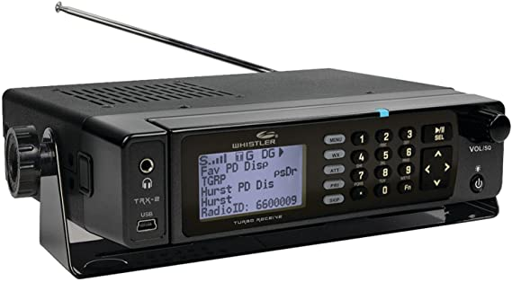
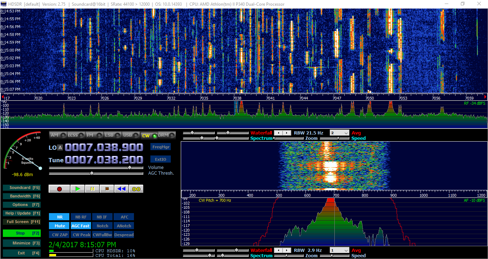

<steelsky>
{
  "title":"Finding Radio Frequencies",
  "description":"A short guide on finding radio frequencies.",
  "tags":"#radio #frequency #waves"
}
</steelsky>
# Finding Radio Frequencies
## Reference Sites
These sites can be used to look of frequencies in your area. 

* http://www.interceptradio.com
* https://www.radioreference.com

## Using A Scanner
A popular way to find signals is to use a radio scanner. These are special devices made specifically for quickly scanning through frequency bands and detecting signals. 

## Using An SDR Waterfall
A powerful SDR like the HackRF One with a large bandwidth can also be very useful for finding radio signals. 

*Source: hamradioqrp.com | Software: HDSDR*

