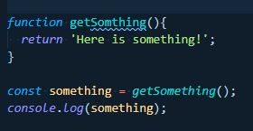

<steelsky>
{
  "title":"Should Your IDE Have Spellcheck?",
  "description":"My thoughts on spellcheck in your IDE.",
  "tags":"#programming #thoughts"
}
</steelsky>
# Should Your IDE Have Spellcheck?

## What I always hear

I've heard a lot of arguments for using some kind of spellcheck in your IDE or code editor. Usually the reasoning that I hear for this that we sometimes type a lot of strings and this can lead to user facing spelling errors. Honestly I think that is a pretty weak argument. 

Unless you're a front-end developer, you probably shouldn't be typing strings that an end-user will see. At least not on a regular basis. I'm not saying using a spell check plugin for this purpose is wrong in any way, just that there is probably is a better argument that can be made.  


## An even better reason?

Imagine that we are writing some code like this:

```javascript

function getSomthing(){
  return 'Here is something!';
}

const something = getSomething();
console.log(something);

```

You might have already noticed the issue in the above code. There is a spelling error in the function declaration. It's declared as `getSomthing` where it should be `getSomething`.

I would argue that a spelling issue dealing with object names can be even more detrimental than a spelling issue in a string.

Noticing this kind of thing can be inconsistent and **increases cognitive load**. 

**Not** noticing this kind of thing can lead to very, very frustrating bugs. 

## Using spellcheck



Right now, I'm using the VSCode plugin [vscode-spell-checker](https://github.com/streetsidesoftware/vscode-spell-checker). With this plugin I can easily notice the issue above at a glance. 

This plugin has support for camelCase and actually correcting the words as well. 


